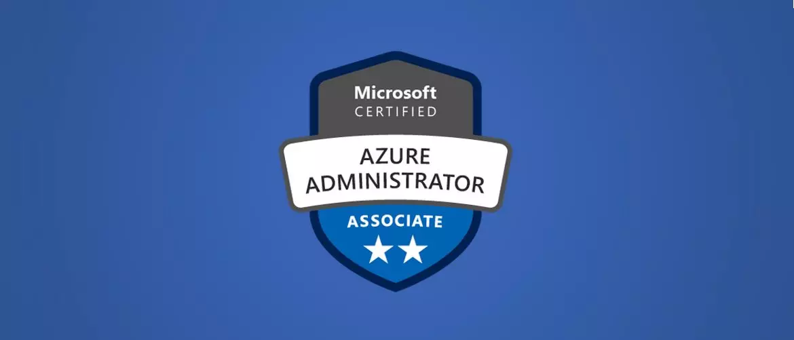

Exame AZ-104: Microsoft Azure Administrator
----

Os candidatos a este exame devem ter experiência na implementação, gerenciamento e monitoramento do ambiente Microsoft Azure da organização.

O candidato a este exame deve ter pelo menos seis meses de experiência prática na administração do Azure, além de sólida compreensão dos principais serviços, cargas de trabalho, segurança e governança do Azure. Além disso, esta função deve ter experiência no uso de modelos do PowerShell, Azure CLI e Azure portal e do Azure Resource Manager.

----

**Habilidades medidas**

- Identidades e governança do Manage Azure (15-20%)
- Implementar e gerenciar armazenamento (15-20%)
- Implantar e gerenciar recursos de computação do Azure (20-25%)
- Configurar e gerenciar redes virtuais (25-30%)
- Monitorar e fazer backup de recursos do Azure (10-15%)

Auxilio ao conteúdo
----

*Learning path da microsoft*
https://docs.microsoft.com/pt-br/learn/paths/az-104-administrator-prerequisites/

*Laboratórios Praticos para a certificação 104 ( GITHUB OFFICIAL DA MICROSOFT )*

https://github.com/MicrosoftLearning/AZ-104-MicrosoftAzureAdministrator

*Curso AZ 104 Udemy*

https://www.udemy.com/course/70533-azure/

*Curso Az 104 A cloud Guru -- Gratis por 15 dias, da tempo de fazer sem pagar mas não tera acesso ao painel da azure ou aos dumps e partes praticas qeu a plataorma lhe da acesso. :-)*

https://acloudguru.com/course/az-104-microsoft-azure-administrator-certification-prep

Boa Sorte;
 
