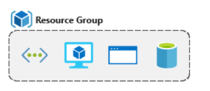

# O que são recursos ?

Recurso é tudo aquilo que existe em um determnado local dentro do seu cloud azure. 
Esses recursos variam entre vms, bancos de dados, redes, storage e etc. São como os recursos de rede mas alocados sobre uma parte do seu tenant no azure
Esses Recursos são aglomerados dentro do azure em uma localidade chamada ressource group.

----

##O que é um resource Group ?

----

É um conteiner lógico de recursos no azure que permite adiministrar
 os recurso do azure de forma que existam diferentes exigencias em determinado grupo de recursos. 
Exemplo : Regras de Rback, Tags, Bloqueios de recursos e muito mais